# complier-pl0

编译原理：pl0实验与课设

## commit记录

每一步的代码实现，都可以点开`commit`记录查看更改：

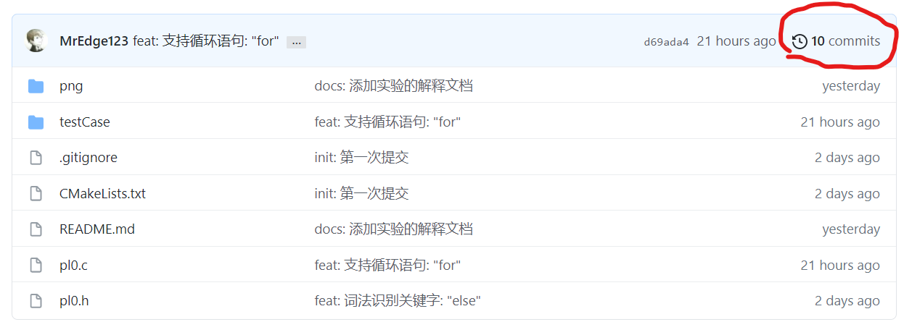

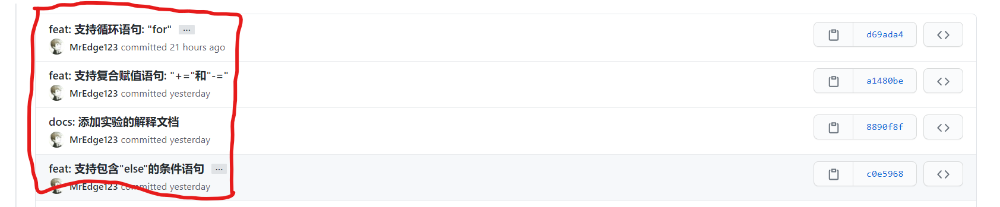

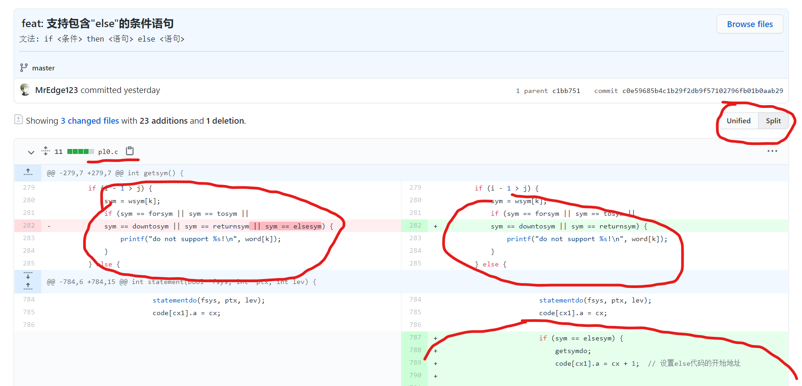

有对比的方式，还有显示在哪个文件，修改了哪些地方，便于查看。

## 实验

### 实验要求

1. 增加单词：关键字：`for`，`to`，`downto`； 符号: `+=`，`-=`，`++`，`--`。 要求: 词法识别即可
2. 替换单词：不等号`#`改为`<>`
3. 增加条件语句的`else`子句

### 实验内容

#### 1.增加若干个单词（只需词法识别）

单词的定义位置：`pl0.h`中的`enum symbol`

```c
enum symbol
{
    nul,
    ident,
    number,
    plus,
    minus,
    ...,
}
```

涉及到的变量：

`pl0.h`中：

> `symnum`：单词数量，取决于`symbol`中有多少个单词
> 
> `norw`：关键字数量，取决于`symbol`中有多少个关键字（保留字）

要求中，需要新增8个单词和4个关键字，所以：

```
symnum += 8;
norw += 4
```

`pl0.c`，`init()`函数中：

> `word`：关键字的字符串数组，`word[i]`代表第`i`个关键字的字符串形式。顺序是按照从小到大的[字典序](https://baike.baidu.com/item/%E5%AD%97%E5%85%B8%E5%BA%8F) ，作用：二分查找关键字
> 
> `wsym`：关键字数组。`wsym[i]`代表第`i`个关键字，与`word[i]`是一一对应的

在修改时，要注意：

1. `word`要按照从小到大的字典序
2. `wsym[i]`和`word[i]`必须一一对应，即相同的下标，含义是同样的单词

最重要的地方，**词法识别**：`getsym()`函数

对于新关键字，是在`搜索当前符号是否为保留字`这个位置进行识别的。只要我们修改了`word`和`wsym`变量，这里就可以识别到关键字。

对于新符号，是在`按照单字符符号处理`这个**位置前**进行识别的，原因是：我们添加的新符号，第一个字符，即`+`，`-`，修改前是在这个位置处理的。

#### 2.替换单词（不等号`#`改为`<>`）

这部分比较简单，只需要在`init()`函数的`ssym`去掉对`#`的识别，在`getsym()`增加对`<>`的识别即可。详细看commit记录。

#### 3.增加条件语句的`else`子句

首先，按照上述增加单词的方法，增加关键字`else`

接下来，要对`else`进行语义分析：

`else`子句的文法：`if <条件> then <语句> else <语句>`

从文法中可知：`else`子句应该在分析了`if then`语句代码的后面。所以开始寻找`if then`语义分析的代码位置。

通过搜索`thensym`，发现在`statement()`函数中的`thensym`位置才是需要修改的。

从当前位置，先分析之前的`if then`语句是怎样进行语义分析的：

代码解释：

> `nxtlev`：后跟单词数组，在处理`<条件>`前，需要设置`<条件>`的后跟单词
>
> `conditiondo()`：处理`<条件>`函数`condition()`的宏定义
>
> `cx`，`cx1`：`cx`为最新指令的末尾位置；`cx1`则是记录指令位置的临时变量
>
> `gendo()`：生成指令函数`gen()`的宏定义。每生成一条指令，`cx`就会加`1`
>
> `statementdo()`：处理`<语句>`函数`statement()`的宏定义
> 
> `code`：指令数组，存放生成的指令

流程图：

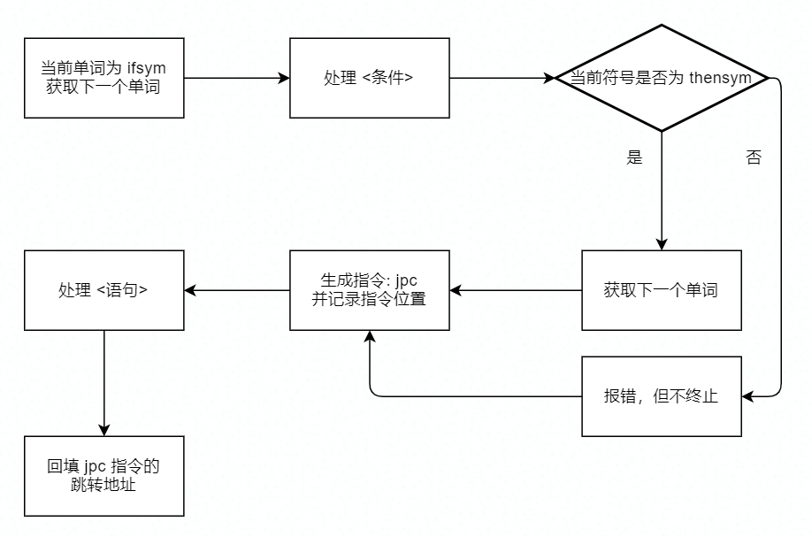

如果要进一步理解代码，必须知道pl0**代码**和pl0**指令**的对应关系，接下来介绍pl0指令集：

<span id="plcode"></span>

pl0虚拟机的组成，解释程序：`interpret()`函数

> `s`：存储栈，这里用数组进行实现
> 
> `t`：栈顶指针，即栈顶的位置
> 
> `i`：当前的指令
> 
> `p`：指令地址，即指令的位置
> 
> `b`：指令基址，关于层次功能的实现需要用到

整个解释程序，就是**从上到下按顺序**（除了一些跳转指令）执行指令，中间数据用**栈**来存储。

虚拟机指令格式：

```
F L A
```

含义：

> `F`：指令的类型
> 
> `L`：在某些指令中，表示层次差。如果没用到则为0
> 
> `A`：不同指令含义不同

详细指令在书`P15`页，这里只介绍关键的指令：

> **注意**：书上的`opr`二元比较指令的说明，与解释程序刚好**相反**。这里以**解释程序为准**
> 
> `opr 0 a`，`a ∈ [8,13]`：二元比较指令。如果满足条件，则将`1`存入次栈顶；否则，将`0`存入次栈顶；最后栈顶指针`t`减1
> 
> `jpc 0 a`：条件跳转指令。如果栈顶为`0`，则当前的指令指针，跳转到指令地址`a`；否则什么都不做，继续执行下一条指令
> 
> `jmp 0 a`：直接跳转指令。当前的指令指针，直接跳转到指令地址`a`

有了上述知识后，我们可以尝试得出`if then`语句和指令的对应关系：

```
1| if <条件> then  // opr 0 a; jpc 0 i; 即不满足条件就跳转到第8行的位置
2| begin
3|     <语句1>;    // ...
4|     <语句2>;    // ...
*|     ...  
7| end;
8| <语句>          // 由第i个指令开始 (i不一定等于8, 要看扫描到这里时的cx变量值)
```

<span id="fill"></span>

注意到，在生成`jpc`指令的时候，因为是从上到下分析的，这时还不知道**跳转的指令地址**。所以，只能当知道指令地址的时候，再**反填**指令地址，`jpc`指令才算完整

**反填**在代码中的体现：

> 用`cx1`这个临时变量，记录`jpc`指令的位置。处理完`<语句>`后，根据`cx1`找回之前的指令。最后把最新的指令地址`cx`，填入到之前指令的`A`地址部分

这时，我们应该明白流程图的这两个步骤了：

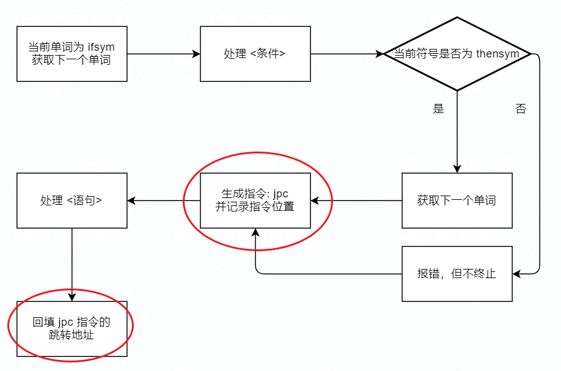

接下来考虑`if then else`语句和指令的对应关系：

```
01| if <条件> then    // opr 0 a; jpc 0 i; 即不满足条件就跳转到第11行的位置
02|     begin
03|         <语句1>;  // ...
04|         <语句2>;  // ...
**|         ...
08|     end          // jmp 0 j; 直接跳转到17行的位置
09| else
10|     begin
11|         <语句1>;  // 由第i个指令开始
12|         <语句2>;
**|         ...
16|     end;
17| <语句>            // 由第j个指令开始
```

上面用`begin end`语句是为了具体化，更加方便理解，现在抽象成一般情况：

**特别提醒**：`cx`含义为当前最新指令地址

```
1| if <条件> then  // opr 0 a; jpc 0 i;
2|     <语句>
3|                // 回填jpc指令, i = cx + 1
4| else           // jmp 0 j;
5|     <语句>;     // 由第i个指令开始
6|                // 回填jmp指令, j = cx
7| <语句>          // 由第j个指令开始
```

小细节：`i = cx + 1`是为了跳过`jmp`指令

最后，要注意修改完后，原来的`if then`语句也能正常工作。

`else`子句的流程图：

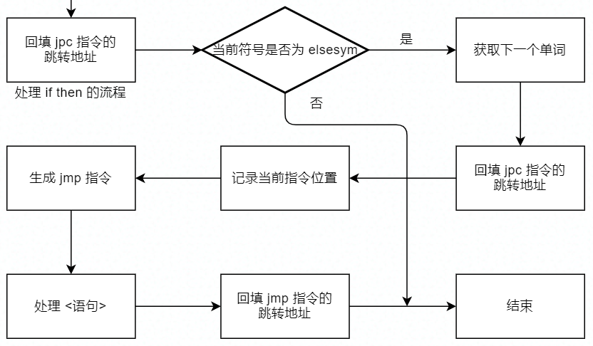

## 课设

### 基本要求

1. 扩充赋值运算符：`+=`，`-=`
2. 扩充语句（Pascal的`for`语句）

`for`语句文法：

```
1. for <变量> := <初值> to <终值> do <语句>
2. for <变量> := <初值> downto <终值> do <语句>
```

其中，`初值`和`终值`均为`表达式`。语句1的**步长为2**；语句2的**步长为-2**

### 具体实现

**注意**：先确保自己对pl0指令集和虚拟机有大概的了解

[实验部分](#plcode)已经概述了有关pl0指令集和虚拟机，不明白可以往回看或者自己思考

#### 1.扩充赋值运算符：`+=`，`-=`

首先，我们要理解复合赋值运算符，这里以`+=`为例子：

```
a += b => a = a + b
```

即：`+=`是由**赋值运算**和**加法运算**组合而成的

接下来研究**赋值运算**和**加法运算**如何转化成**虚拟机指令**：

寻找赋值运算语义分析的代码位置：`statement()`中的`becomes`

整个处理赋值运算的逻辑并不复杂：

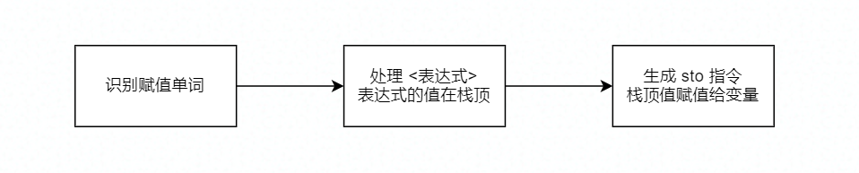

关键的地方有两个，一个是：处理完`<表达式>`后，会把结果放到**栈顶**；另一个是`sto`指令；

> `sto l a`：将**栈顶**的值，存入层次差为`l`，偏移量为`a`的位置，最后栈顶指针`t`减1

这里我们暂时不需要理解层次差和偏移量，只需要知道`sto`指令生成的方法即可：

```
gendo(sto, lev-table[i].level, table[i].adr);
```

现在，我们理解了**赋值运算的操作**是：把**值**放入**栈顶**，然后利用`sto`指令进行赋值

所以，对于`+=`等这类复合赋值运算的实现，关键也是把**计算好的值**放到**栈顶**

下面了解**加法运算**如何转化成虚拟机代码：

首先了解加法运算的指令：

> `opr 0 2`：次栈顶和栈顶的值相加，结果存入次栈顶，栈顶指针`t`减1

栈结构图：

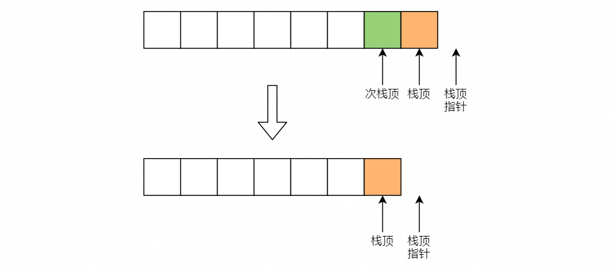

小细节：在代码实现中，栈顶指针并不是指向栈顶，而是指向栈顶的后一个位置

现在回忆一下要转化的目标：`a = a + b`，`b`为表达式的值，`a`为变量的值，即还差：如何把变量的值取出来。

取出变量的值的指令`lod`（和`sto`相反）：

> `lod l a`：将层次差为`l`，偏移量为`a`的位置的值，取到栈顶指针的位置。最后栈顶指针`t`加1

栈结构图：

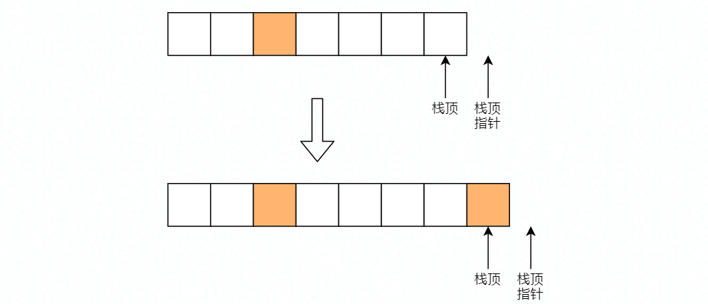

生成`lod`指令的方法（类比`sto`指令）：

```
gendo(lod, lev-table[i].level, table[i].adr);
```

综合上述知识，得出`+=`运算的语义分析的**大致思路**：

> `a += b` 的语义： `a = a + b`，`a`为变量，`b`为表达式

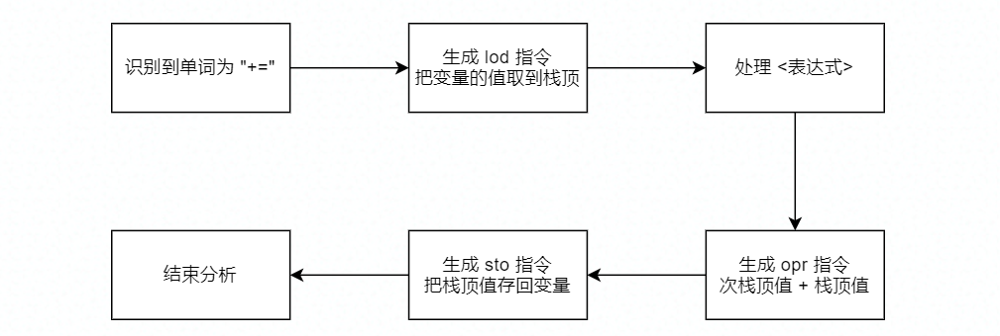

`-=`运算同理，其他`*=`，`/=`等等复合赋值运算也是同理可得

#### 2.扩充语句（Pascal的`for`语句）

开始前先回顾一下：[反填](#fill)地址的方法

这里以`for <变量> := <初值> to <终值> do <语句>`为例：

先寻找`for`语句应该在哪个位置开始实现：`statement()`函数中，最后一个`else`语句块

开始分析语句，语句由3个部分组成：

> `for <变量> := <初值>`：初始化：需对变量进行赋值
> 
> `to <终值>`：条件判断：如果变量的值小于等于终值，就执行循环体，否则跳出循环
> 
> `do <语句>`：执行循环体：处理语句之后，变量增加步长，并且跳转到条件判断

##### 第1部分：初始化

此部分代码可以参考赋值语句的实现：

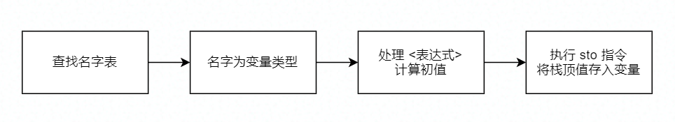

其中，查找名字表时，使用了`position()`函数：

> 如果在名字表中找到名字，则会返回该名字在名字表的下标；否则，返回的下表值为0

指令回顾：

> `sto l a`：将**栈顶**的值，存入层次差为`l`，偏移量为`a`的位置，最后栈顶指针`t`减1

##### 第2部分：条件判断

条件判断的主要思路：取出变量值，然后计算终值，变量值与终值进行比较，最后生成跳转指令

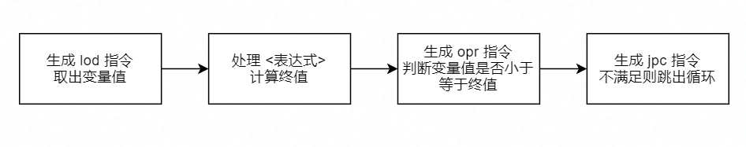

指令回顾：

> `lod l a`：将层次差为`l`，偏移量为`a`的位置的值，取到栈顶指针的位置。最后栈顶指针`t`加1
> 
> `opr 0 13`：如果次栈顶的值小于等于栈顶的值，则将`1`存入次栈顶；否则，将`0`存入次栈顶；最后栈顶指针`t`减1
> 
> `jpc 0 a`：条件跳转指令。如果栈顶为`0`，则当前的指令指针，跳转到指令地址`a`；否则什么都不做，继续执行下一条指令

在这部分，还需要记录两个指令地址：条件判断开始时的指令地址，`jpc`指令的指令地址。

原因：

> 1. 执行完循环体后，循环体需要跳转到条件判断的位置，
> 2. `jpc`指令的跳转地址需要分析完循环体后，才能**反填**

所以第2部分的流程是：

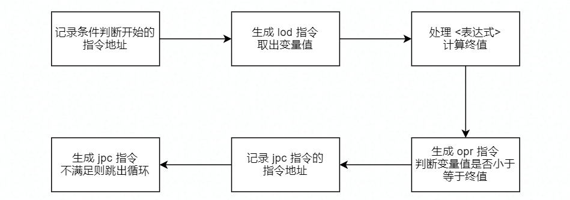

##### 第3部分：执行循环体

这部分的主要思路是：处理语句，然后变量加上步长，最后跳转到条件判断的位置

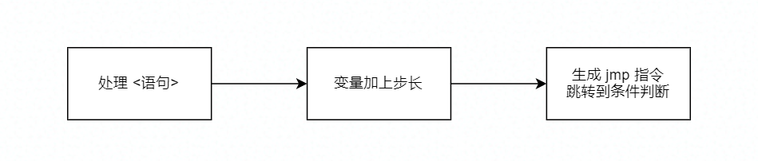

指令回顾：

> `jmp 0 a`：直接跳转指令。当前的指令指针，直接跳转到指令地址`a`

这里需要解决的是，变量如何加上步长？思路：

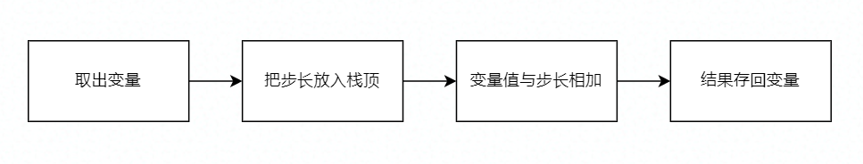

把步长放入栈顶，需要用到新指令：`lit`指令

> `lit 0 a`：把立即数`a`放入栈顶

因为步长为2，所以`a`的值为2

最后，生成完`jmp`指令后，还要**反填**`jpc`指令，所以第3部分流程是：

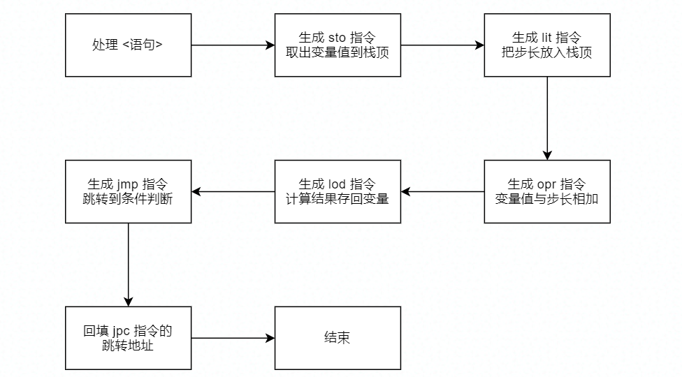

##### 语句与指令的对应关系

```
01| for <变量> := <初值>  // ...; sto l a;
02| to                   // 由第i个指令开始
03| <终值>               // lod l a; ...; opr 0 13; jpc 0 j; 跳转到第14行 
04| do                  
05|     begin
06|         <语句1>;      // ...
07|         <语句2>;      // ...
**|         ...
11|     end            
12|                      // sto l a; lit 0 2; opr 0 2; lod l a;
13|                      // jmp 0 i; 跳转到第2行
14| <语句>               // 由第j个指令开始
```
